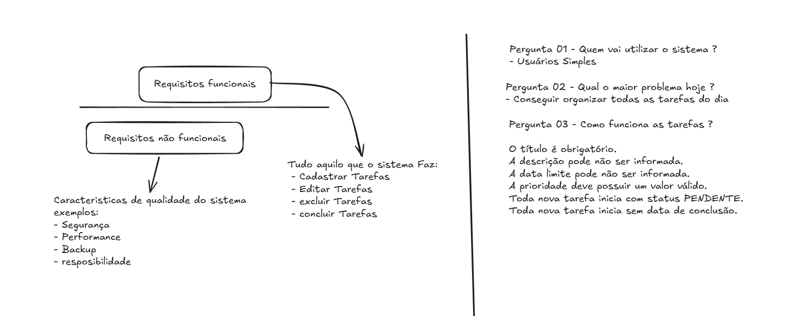

# Sistema de Controle de Tarefas Pessoais

## Objetivo

Desenvolver um sistema web para gerenciamento de tarefas pessoais, permitindo que usuários criem, editem, concluam, listem e removam tarefas de forma simples e intuitiva.

O sistema deverá garantir a integridade dos dados, respeitar as regras de negócio e oferecer uma maneira eficiente de acompanhar o andamento das tarefas.

---

## Problema

O sistema busca solucionar os seguintes problemas:

- Dificuldade em organizar tarefas do dia a dia.
- Falta de acompanhamento do progresso das atividades.
- Procrastinação causada pela ausência de planejamento.
- Necessidade de um gerenciamento simples e centralizado.

---

## Escopo

O sistema permitirá ao usuário:

- Criar tarefas.
- Visualizar todas as tarefas cadastradas.
- Atualizar informações de uma tarefa.
- Marcar tarefas como concluídas.
- Excluir tarefas pendentes.

---

# Requisitos Funcionais

### RF-01 — Cadastro de Tarefa

O sistema deverá permitir que o usuário cadastre uma nova tarefa informando título, descrição, prioridade e data limite.

---

### RF-02 — Listagem de Tarefas

O sistema deverá exibir todas as tarefas cadastradas, apresentando suas principais informações.

---

### RF-03 — Conclusão de Tarefa

O sistema deverá permitir que uma tarefa pendente seja marcada como concluída, registrando automaticamente a data e hora da conclusão.

---

### RF-04 — Edição de Tarefa

O sistema deverá permitir a atualização das informações de uma tarefa, respeitando as regras de negócio para tarefas concluídas.

---

### RF-05 — Remoção de Tarefa

O sistema deverá permitir a exclusão apenas de tarefas pendentes.

---

# Requisitos Não Funcionais

### RNF-01 — Segurança

O sistema deverá validar todas as entradas do usuário para evitar dados inválidos.

---

### RNF-02 — Performance

As operações de cadastro, consulta e atualização deverão possuir tempo de resposta adequado para uma aplicação de pequeno porte.

---

### RNF-03 — Persistência

As tarefas deverão permanecer armazenadas mesmo após o encerramento da aplicação.

---

### RNF-04 — Responsividade

A interface deverá ser compatível com dispositivos desktop e dispositivos móveis.

---

# Regras de Negócio

### RN-01 — Tarefa Atrasada

Uma tarefa será considerada atrasada quando estiver pendente, possuir data limite e essa data já tiver expirado.

---

### RN-02 — Tarefa Sem Prazo

Tarefas sem data limite nunca poderão ser consideradas atrasadas.

---

### RN-03 — Tarefa Concluída

Uma tarefa concluída não poderá ser considerada atrasada nem concluída novamente.

---

### RN-04 — Criação

Toda tarefa criada deverá iniciar com o status **Pendente** e sem data de conclusão.

---

### RN-05 — Conclusão

Ao concluir uma tarefa, o sistema deverá registrar automaticamente a data e hora da conclusão.

---

### RN-06 — Integridade dos Estados

O sistema deverá impedir estados inválidos, como:

- concluir uma tarefa já concluída;
- excluir uma tarefa concluída;
- alterar indevidamente o status de conclusão;
- persistir dados inconsistentes.

---

# Fluxo Geral

```text
Criar Tarefa
      │
      ▼
Status = Pendente
      │
      ├── Editar
      ├── Excluir
      ├── Verificar atraso
      │
      ▼
Concluir
      │
      ▼
Status = Concluída
      │
      ▼
Editar apenas descrição
```

---

# Diagrama

> Inserir diagrama de casos de uso, classes ou fluxo da aplicação.

